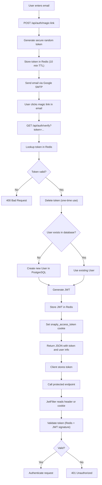
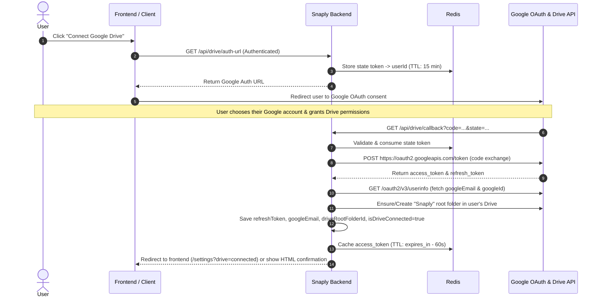

# Auth Flow

This project uses email magic links for passwordless authentication, JWT for API token management, and Redis for token persistence.

## What Is Implemented Now

- Email magic link is the entry point for authentication.
- The user submits their email address to `POST /api/auth/magic-link`.
- The backend generates a secure one-time token, stores it in Redis (10-minute TTL), and sends a sign-in email via Google SMTP.
- The user clicks the link in their email, which calls `GET /api/auth/verify?token=...`.
- The backend verifies the token against Redis (one-time use), creates the user if they don't exist, and returns a JWT.
- The JWT is stored in Redis and also sent back to the client as an `HttpOnly` cookie named `snaply_access_token`.
- A guarded dev-login endpoint is available for backend-only development when `AUTH_DEV_LOGIN_ENABLED=true`.
- Protected endpoints accept the JWT from either the `Authorization: Bearer <token>` header or the `snaply_access_token` cookie.
- Redis is used for JWT token tracking/validation and magic link token storage.

## Configuration You Need For Development

Put real values in `snaply-backend/.env` for these keys:

- `PGHOST`
- `PGPORT`
- `PGDATABASE`
- `PGUSER`
- `PGPASSWORD`
- `SMTP_USERNAME` (your Gmail address)
- `SMTP_PASSWORD` (Google App Password — requires 2FA enabled)
- `JWT_SECRET`

Optional:

- `FRONTEND_URL`

If `FRONTEND_URL` is blank, the magic link in the email points to the backend directly (`http://localhost:8080/api/auth/verify?token=...`).

If you want to skip magic link auth while building the backend, set `AUTH_DEV_LOGIN_ENABLED=true`.

Make sure Redis is running locally on `localhost:6379`.

## How The Login Flow Works

1. The user submits their email to `POST /api/auth/magic-link`.
2. The backend generates a cryptographically secure random token.
3. The token is stored in Redis with key `snaply:magic:{token}` → email (10-minute TTL).
4. An HTML email with a "Sign in to Snaply" button is sent via Google SMTP.
5. The user clicks the link in their inbox.
6. `GET /api/auth/verify?token=...` looks up the token in Redis.
7. If valid, the token is deleted from Redis (one-time use).
8. If the user does not exist, a new `User` record is created with their email.
9. A JWT is generated and stored in Redis.
10. The JWT is written to the `snaply_access_token` cookie and returned as JSON.

## How Protected Requests Work

- `JwtFilter` runs before protected endpoints.
- It first looks for `Authorization: Bearer <token>`.
- If that header is missing, it checks the `snaply_access_token` cookie.
- The filter extracts the email from the JWT, loads the `User` from the database, and checks that Redis still contains the same token.
- If everything matches, Spring Security marks the request as authenticated.

## How Logout Works

- `POST /api/auth/logout` removes the JWT from Redis.
- It also clears the Spring Security context.
- The browser cookie still exists unless the client clears it, but the token is no longer valid because Redis no longer recognizes it.

## Backend-Only Development Flow

Use this flow while the frontend is not built yet:

1. Start PostgreSQL, Redis, and the backend.
2. Set `SMTP_USERNAME`, `SMTP_PASSWORD`, and `JWT_SECRET` in `.env`.
3. Leave `FRONTEND_URL` empty.
4. Optional: set `AUTH_DEV_LOGIN_ENABLED=true` if you want a local backend-only login shortcut.
5. Send a magic link request or call the dev login endpoint.
6. After sign-in, the backend returns JSON with the token and user details.
7. Use that token in Postman, curl, or your API client.
8. Call protected endpoints with `Authorization: Bearer <token>`.

Magic link example:

```bash
curl -X POST http://localhost:8080/api/auth/magic-link \
  -H "Content-Type: application/json" \
  -d '{"email":"you@gmail.com"}'
```

Dev login example:

```bash
curl -X POST "http://localhost:8080/api/auth/dev-login?email=test@example.com&name=Test%20User"
```

Using a protected endpoint:

```bash
curl -H "Authorization: Bearer <token>" http://localhost:8080/api/auth/me
```

## Complete Flowchart



## Important Notes

- Sign-up is automatic on first magic link verification. There is no separate signup flow.
- The magic link token is one-time use — clicking the link a second time returns an error.
- The backend is safe to develop without a frontend because the magic link in the email points to the backend directly when `FRONTEND_URL` is blank.
- If you change the JWT secret or clear Redis, all existing tokens become invalid.
- Google SMTP requires a Google App Password (not your regular Google password). Enable 2FA on your Google account first, then create an App Password at https://myaccount.google.com/apppasswords.


## Google Drive Integration

Snaply integrates directly with Google Drive to store user photos, videos, and folder structures in the user's personal Google Drive account.

### 1. OAuth Account Selection Flow
To ensure users can select which Google Drive account to use (even if already logged into multiple Google accounts in their browser), the authorization endpoint explicitly configures `prompt=consent select_account` and `access_type=offline`.



### 2. Configuration (`.env` / `application.properties`)
Add these variables to your `.env` file:
```env
GOOGLE_CLIENT_ID=your-google-client-id.apps.googleusercontent.com
GOOGLE_CLIENT_SECRET=your-google-client-secret
GOOGLE_DRIVE_REDIRECT_URI=http://localhost:8080/api/drive/callback
```
> [!NOTE]
> In the Google Cloud Console (APIs & Services > Credentials), enable **Google Drive API** and add `http://localhost:8080/api/drive/callback` under **Authorized redirect URIs**.

### 3. Google Drive Endpoints
- `GET /api/drive/auth-url` (Protected): Generates the Google OAuth authorization URL for the authenticated user.
- `GET /api/drive/connect` (Protected): Directly redirects browser (HTTP 302) to Google's consent & account selection screen.
- `GET /api/drive/callback?code=...&state=...` (Public): Handles Google OAuth redirect, stores tokens, initializes the user's `Snaply` root Drive folder.
- `GET /api/drive/status` (Protected): Returns current Google Drive connection status:
  ```json
  {
    "connected": true,
    "googleEmail": "user@gmail.com",
    "googleId": "108392...",
    "driveRootFolderId": "1a2b3c..."
  }
  ```
- `POST /api/drive/disconnect` (Protected): Disconnects Google Drive from user's account and revokes cached tokens.

### 4. Media Endpoints
- `POST /media/upload` (Protected, `multipart/form-data`):
  - Parameters: `file` (MultipartFile), `folderId` (Long)
  - Automatically uploads to the appropriate Google Drive folder and saves a `Media` database record with `driveFileId` and `fileUrl`.
- `GET /media/download/{mediaId}` (Protected): Downloads file bytes directly from Google Drive with `Content-Disposition: attachment; filename="..."`.
- `GET /media/stream/{mediaId}` (Protected): Streams file bytes directly from Google Drive with `Content-Disposition: inline` for browser preview (images, videos, documents).
- `GET /media/get/{mediaId}` (Protected): Returns `MediaDTO` by ID.
- `DELETE /media/delete/{mediaId}` (Protected): Deletes the file from Google Drive and removes the database record.
- `GET /media/getAllMedia/{folderId}` / `POST /media/getAllMedia/{folderId}`: Lists all media in a folder.
- `GET /media/getCount/{folderId}` / `POST /media/getCount/{folderId}`: Returns media count for a folder.

### 5. Automatic Group & Folder Hierarchy in Google Drive
- **Group Creation**: If the user has connected Google Drive, a dedicated folder for the group is automatically created in Google Drive inside the user's `Snaply` root folder, and `group.driveFolderId` is saved.
- **Folder Creation**: When a folder is added to a group, a subfolder is automatically created in Google Drive inside the group's Drive folder, and `folder.driveFolderId` is saved.
- **Folder / Group Deletion**: Deleting a folder or group automatically removes the corresponding folder and its contents from Google Drive.